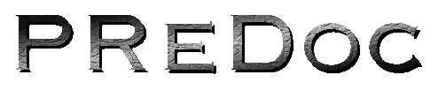
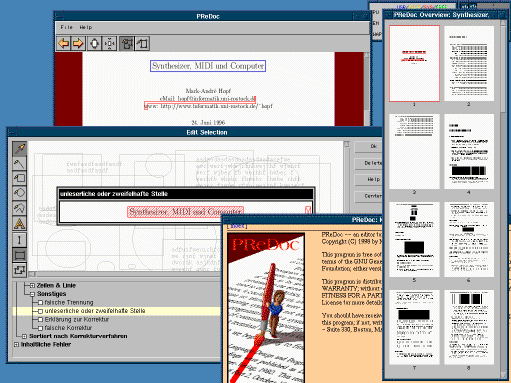
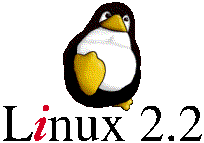

 
 
An Editor for Proof-Reading Digital Documents 
Verfügbar unter den Bedingungen der GNU General Public License (GNU GPL) 

Requirements (full-build):

- Linux 2.1.130 or higher
- GNU C Library 2.0.6 or higher
- LinuxThreads 2.0.6 or higher
- libpng 1.0.1
- zlib 1.1.1
- Cygnus Solutions EGCS 1.1.1 C++ Compiler
- GNU make
- Java Development Kit 1.1.x or higher
- IBM Jikes Java Compiler 0.41 or higher (optional)

Compiling:

Just run `make'.

PReDoc ist eine in Java realisierte Teilkomponente des ReSy Projekts zur
computergestützten Einreichung, Begutachtung und Korrektur
wissenschaftlicher Veröffentlichungen und hat die Aufgabe, Dokumente mit
Korrekturinformation versehen zu können.

PReDoc ist aus drei Gründen relativ unbrauchbar:
		
* ReSy wurde nie abgeschlossen und PReDoc fehlen daher die nötigen
  Rahmenkomponenten wie z.B. der Dokumentenserver.

* PReDoc wurde unter Java 1.1 entwickelt und funktioniert nicht
  mehr korrekt unter Java 1.2.

* Java ist einfach zu langsam.
		
In der vorliegenden Version kann PReDoc Korrekturen nach DIN 16511 an
PostScript Dokumenten durchführen. Der zu Demonstrationszwecken
beiliegende Server konvertiert dafür PostScript Dokumente in die von
PReDoc benötigten Bitmaps. Dieser allgemeine Ansatz ermöglicht es,
PReDoc für alle auf Papier druckbaren Dokumentformate einzusetzen.
		
Nach einer rudimentären Analyse der Bitmaps kann PReDoc Markierungen in
vielen Fällen am Textfluß ausrichten, so daß sich dieser Teil der Arbeit
ähnlich wie in einer Textverarbeitung gestaltet.

Für die markierten Textstellen können anschließend unterschiedliche
Korrekturen gewählt werden, die je nach Bedarf Texteingaben erlauben
oder aber bei Durchnummerierungen von Zeilen und Wörtern helfen.
				
Für "Freihand"-Korrekturen stehen sogar die Möglichkeiten eines kleinen
Malprogramms zur Verfügung.

PReDoc kann als eigenständiges Programm oder als Applet durch einen
Java 1.1 fähigen Web-Browser, wie z.B. Netscape 4.5, ausgeführt werden.
Der Beispielserver enthält zudem einen eigenen Web-Server, so daß
PReDoc einfach durch Aufruf einer URL wie "http://localhost:8080/"
gestartet werden kann.

Weiterhin sind bereits erste Ansätze für ein HTML basiertes Hilfesystem
integriert, das auf einen eigenen HTML Viewer oder aber auf den Web-Browser,
wenn PReDoc als Applet läuft, zurückgreift.

	Wichtig:
	Der Beispielserver hält was der Name verspricht und ist
	für ein ernsthaftes Arbeiten gänzlich ungeeignet!

created with 
<A HREF="http://www.linux.org/">Linux&nbsp;2.1.125&nbsp;SMP</A>,
<A HREF="http://www.xfree86.org/">XFree86</A>,
<A HREF="http://egcs.cygnus.com/">Cygnus EGCS 1.1.1 C++ Compiler</A>,
<A HREF="http://www.gnu.org/">GNU C Library 2.0.6</A>,
<A HREF="http://www.blackdown.org">Blackdowns&nbsp;JDK 1.1.3&nbsp;Port</A>,
<A HREF="http://www.alphaWorks.ibm.com/formula/Jikes/">IBM&nbsp;JIKES&nbsp;0.39</A>,
<A HREF="http://www.cs.berkeley.edu/~engberg/guavac/">GUAVAC&nbsp;1.2</A>,
<A HREF="http://www.informatik.uni-rostock.de/~hopf/toad/">TOAD&nbsp;0.0.42&nbsp;TPaint</A>,
<A HREF="http://www.cs.wisc.edu/~ghost/index.html">Aladdin&nbsp;Ghostscript&nbsp;4.03</A>,
<A HREF="http://www.gimp.org/">GIMP&nbsp;1.0.0</A> 
and tons of other free and open source software.

Copyright &copy; 1998 Mark-André Hopf 
last updated on 2000-29-07 
Linux is a trademark of Linus Torvalds 
Java und Java Developer's Kit are trademarks of Sun Microsystems, Inc. 
Adobe and PostScript are trademarks of Adobe Systems Inc.

